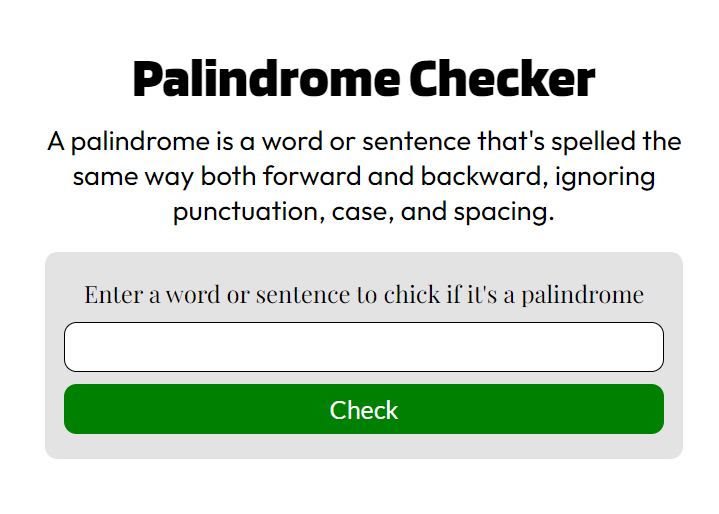

# Palindrome Checker
 A simple program page that checks if a given word is palindrome, made for FreeCodeCamp certification Project using HTML, CSS and JavaScript.

 Enter a word in the input field and press check to check if a word is palindrome, a palindrome is a word that is spelled the same way even when reversed, ignoring punctuation, case, and spacing.

## Page Preview
